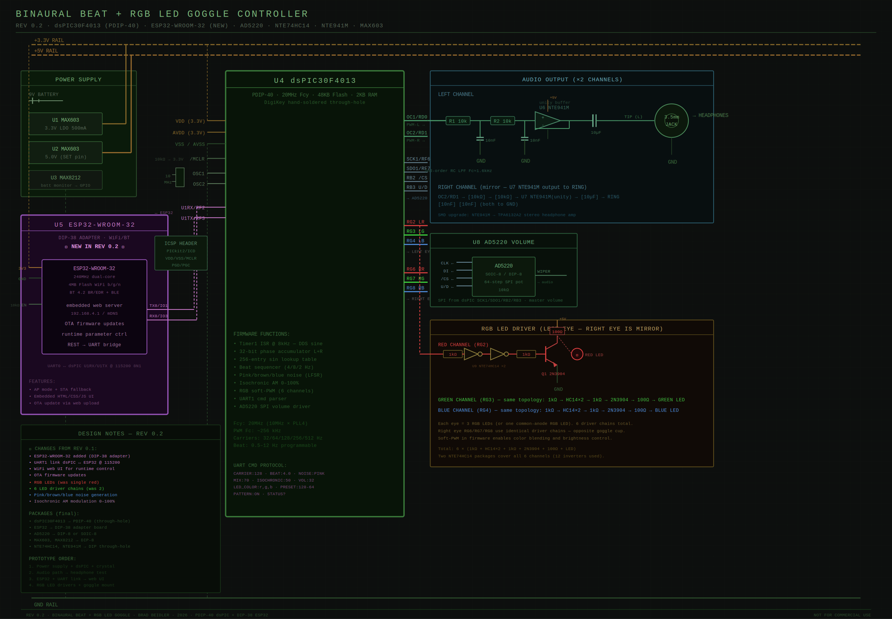

# Binaural Goggle Controller

A DIY meditation/consciousness-exploration device that generates **binaural beat audio** synchronized with **RGB LED visual stimulation**. WiFi-controlled via embedded web UI.

> **Status:** In active development. PCB layout in progress with JLCPCB. Enclosure v7 ordered. Firmware foundations in place.



---

## What it does

- **Stereo binaural beats** via DDS sine generation on a dsPIC30F4013 — programmable carrier (32–512 Hz) and beat (0.5–12 Hz) frequencies
- **Background noise** mixing — pink, brown, blue, white
- **Isochronic AM modulation** 0–100%
- **RGB LED goggles** — 6 driver channels (3 per eye), soft-PWM color control synchronized to the beat
- **WiFi web control UI** served by an onboard ESP32, accessible from any phone/laptop browser
- **OTA firmware updates** for the ESP32

## Architecture

```
[Phone/Laptop] ─WiFi─→ [ESP32-WROOM-32E] ─UART─→ [dsPIC30F4013] ─→ Audio + LEDs
                          (web server)              (DDS engine)
```

Two MCUs by design:
- The **dsPIC** handles all hard-real-time signal processing (8 kHz DDS ISR, beat sequencing, LED PWM)
- The **ESP32** handles WiFi, the web UI, OTA updates, and translates user commands to UART

## Repository layout

| Path | Contents |
|---|---|
| [`hardware/schematic/`](hardware/schematic/) | Circuit schematics (HTML + PNG) |
| [`hardware/pcb/`](hardware/pcb/) | PCB layout files, BOM, Gerbers |
| [`hardware/enclosure/`](hardware/enclosure/) | OpenSCAD source, STL files, JLC3DP drawings |
| [`firmware/dspic/`](firmware/dspic/) | dsPIC30F4013 firmware (MPLAB X / XC16) |
| [`firmware/esp32/`](firmware/esp32/) | ESP32 firmware (PlatformIO / Arduino) |
| [`docs/`](docs/) | Architecture, UART protocol, programming, BOM |

## Building one

See [`docs/programming.md`](docs/programming.md) for the full flash workflow. Short version:

1. Order PCB from JLCPCB using files in `hardware/pcb/`
2. Order enclosure from JLC3DP using files in `hardware/enclosure/`
3. Insert the dsPIC30F4013 into its PDIP-40 DIP socket on the PCB (not stocked by JLCPCB — order from DigiKey)
4. Flash dsPIC via PICkit 4 + MPLAB X
5. Flash ESP32 initial firmware via USB-UART adapter on the programming header
6. All future ESP32 updates happen over WiFi (OTA)

## Hardware

- **Audio:** dsPIC30F4013 PWM → 2-stage RC LPF (Fc≈1.6 kHz) → NTE941M unity buffer → 10µF coupling → 3.5mm jack
- **Volume:** AD5220 64-step SPI digital potentiometer
- **LEDs:** 6× (1kΩ → NTE74HC14×2 → 1kΩ → 2N3904 → 100Ω → RGB LED)
- **Power:** Dual MAX603 LDOs (3.3V logic, 5V LEDs/op-amp), MAX8212 battery monitor
- **WiFi:** ESP32-WROOM-32E

Full BOM in [`hardware/pcb/bom/`](hardware/pcb/bom/).

## Inspirations & references

- Mitch Altman's Brain Machine (the canonical DIY mind machine)
- Tom Campbell's binaural beat patterns (4 Hz base / 8 Hz spikes / 2 Hz dips)
- Robert Monroe's Hemi-Sync research

## License

[CC BY-NC 4.0](LICENSE) — Free to remix, build, and share for non-commercial purposes. Attribution required.

**Not a medical device.** Photic stimulation can trigger seizures in people with photosensitive epilepsy. Use at your own risk.
